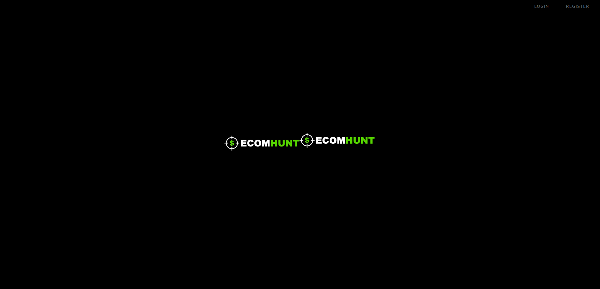
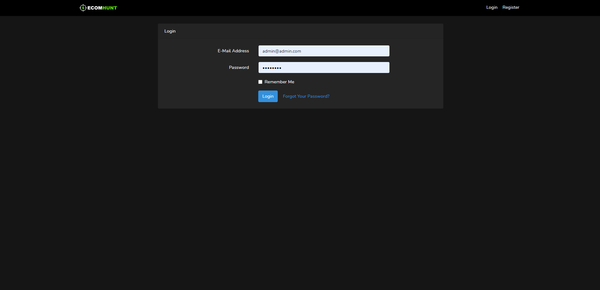
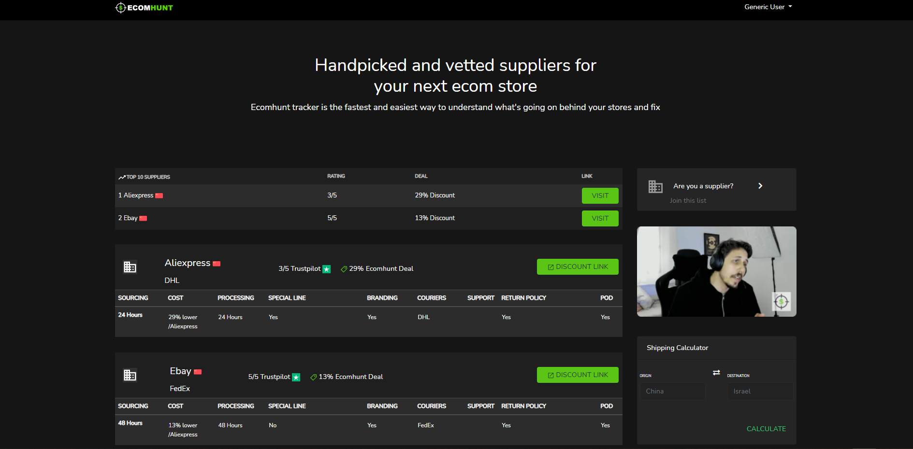
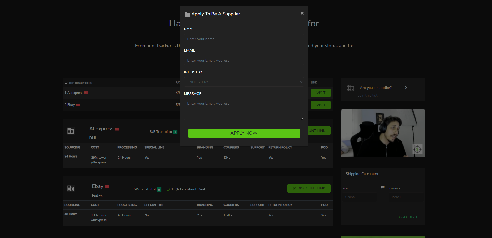
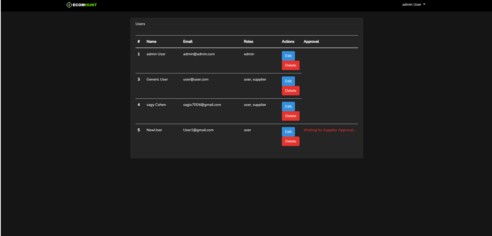
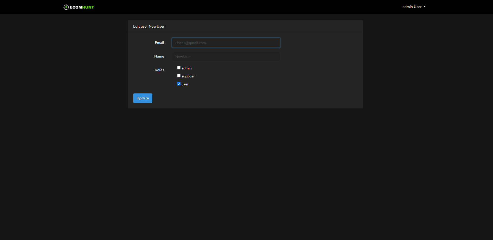
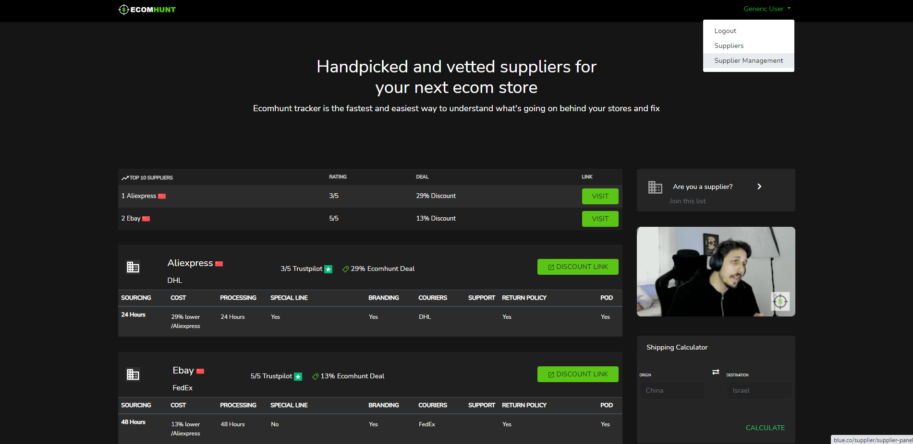
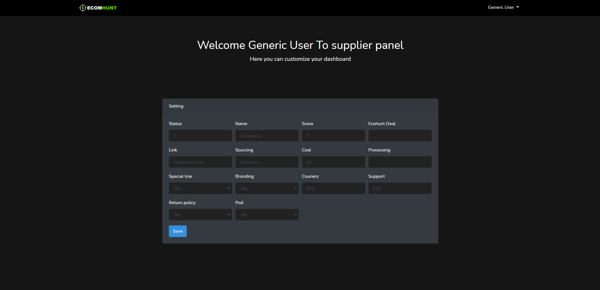

## Installation
- First install DB, db name: bluedb 
- Run php artisan migrate.
- Run php db:seed.
- This will create 2 different users
- 1 Is the Admin with credentials  admin@admin.com and password is "password".
- 2 Is the User with credentials user@user.com and password is "password".

This is the front home page
 

After pressing the login button on the right
Log in with the user And you will be redirected to the user panel

User panel

Pressing on the "Are you Supplier?" button 
You will get the supplier application.

After filling all the fields.
Logout and log in as Admin
And you will get this page
And as you can see there is a user waiting for supplier approval 

Click on edit button and you will be redirected to the edit page
Check the user as supplier and click Update. 

Logout and connect as the user you just change
And in the user panel you will see in the dropdown new option.

This is the Supplier page

The End
